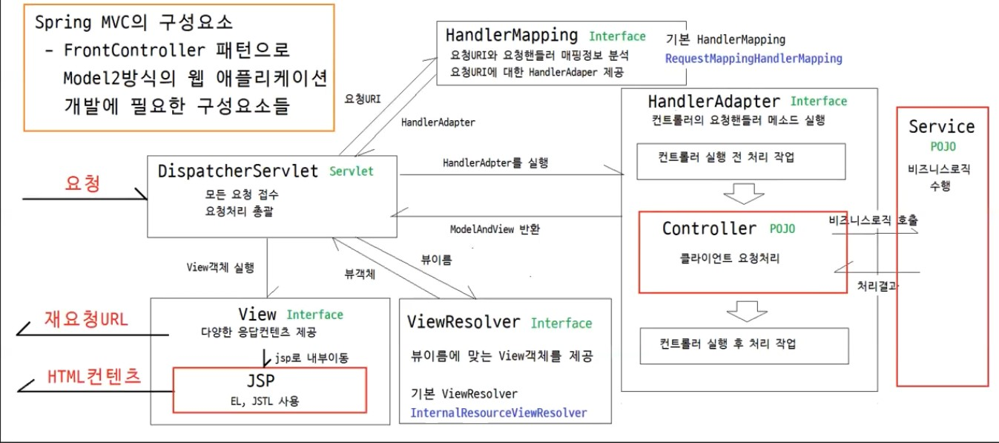

[Spring](#스프링-프레임워크)<br>
[Spring Boot](#spring-boot)<br>
[POJO](#pojo-)<br>
[Bean](#bean)<br>
[Container](#continer-)<br>
[IoC](#ioc)<br>
[DI](#di)<br>
[AOP](#aop)<br>
[DAO , DTO](#dao-와-dto)<br>
[MVC](#mvc)<br>
[GET , POST](#get--post)<br>
[Maven , Gradle](#maven--gradle)<br>
[Scheduling](#scheduling)<br>
[MyBatis](#mybatis-)<br>
[Mapper](#mapper-란-)

### 스프링 프레임워크

- 자바 개발을 편하게 해주는 오픈소스 애플리케이션 프레임워크 (자바 프로그램을 쉽게 만들도록 도와주는 하나의 틀 , 묶음 , 도구)
- 목표
    - POJO 기반의 개발을 쉽고 편하게 한다
    - Java Application을 개발하는데 필요한 하부구조를 포괄적으로 제공
    - Spring이 하부구조를 처리하기 때문에 개발자는 Application 개발에 지중
- 간단하게 Spring (스프링) 이라고 불린다
- 동적인 웹사이트를 개발하기 위한 여러가지 서비스를 제공
- 대한민국 공공기관의 웹서비스 개발시 사용을 권장하고 있는 `전자정부 표준 프리음 워크`의 기반 기술

- 주요 기능
    - 의존성 주입 DI
        - 객체간의 의손정을 관리해 코드의 결합도를 낮추고 테스트와 유지보스를 쉽게한다
    - AOP
        - 공통적인 관심 사항을 모듈화하여 코드중복을 줄인다
    - 트랜잭션 관리
        - 데이터베이스 트랜잭션을 쉽게 관리
    - MVC
        - model - view -controller 웹애플리케이션의 설계를 지원
- 특징
    - XML 또는 Java 기반의 설정이 필요
    - 다양한 기능을 제공하지만 프로젝트에 필요한 기능을 선택적으로 추가해야한다

### Spring Boot

- Spring 프레임워크의 확장으로 , 애플리케이션의 빠른 개발과 배포를 지원하는 도구
- 주요 기능
    - 자동설정 : 대부분의 설정을 자동으로 처리하여 설정작업을 줄인다
    - 내장서버 : Tomcat 같은 내장 웹서버를 제공하여 서버 설정과 배포를 간소화
    - 스타터 패키지 : 자주 사용하는 라이브러리와 설정을 미리 구성한 스타터 패키지를 제공하여 의존성 관리가 쉽다

| 특성          | Spring Framework      | Spring Boot                |
|-------------|-----------------------|----------------------------|
| **설정**      | 많은 설정 필요 (XML, 자바 설정) | 자동 설정 ()                   |
| **애플리케이션**  | 별도의 웹 서버 설정 필요        | 내장 웹 서버 (Tomcat) 제공        |
| **스타터 패키지** | 없음                    | 다양한 스타터 패키지 제공 (의존성 관리 용이) |
| **배포**      | 설정과 배포가 복잡할 수 있음      | 독립 실행 가능 (간단한 배포)          |
| **목표**      | 유연한 프레임워크 제공          | 빠른 개발과 배포 지원               |

### POJO ?

- 번역하면 d` 평범한 구식 자바 객체 ` , 프레임워크 인터페이스나 클래스를 구현하거나 확장하지 않는 단순한 클래스
- 객체 지향적인 원리에 충실하며 환경과 특정기술에 종속되지 않고 필요에 따라 언제든 재활용될 수 있는 방식으로 설계된 자바객체
- 특징
    - Java 에서 제공하는 API외에 종속되지 않음
    - 특정규약 , 환경에 종속되지 않음
- 환경에 종속되지 않는 것의 장점
    - 코드의 간결함
    - 비즈니스 로직과 특정환경이 분리되므로 단순
    - 객체지향 설계의 자유로운 사용

### Bean

- 컨테이너 안에 들어있는 객체
- 컨테이너 안에 담겨있으며 필요시 컨테이너에서 가져와 사용
- Bean 이라는 것은 자바빈에서 온것이며 빈은 콩 , 그 콩이 객체를 뜻한다
- 간단하게 `자바빈 == 객체 ` 스프링에서는 빈이라는 이름을 사용하는것 뿐임
- @Component 어노테이션이 붙은 클래스를 자동으로 Bean으로 등록해준다
- @Bean 을 사용하거나 xml 파일 설정을 통해 일반객체를 Bean으로 등록할 수 있다

### Continer ?

- 컨테이너는 보통 인스턴스의 생명주기를 관리한다
- 작성한 코드의 처리과정을 위임받은 독립적인 존재라고 생각하면된다
- 컨테이너는 설정만 되어있다면 누구의 도움없이 프로그래머가 작성한 코드를 스스로 참조해 알아서 객체의 생성과 소멸을 컨트롤해준다
- Spring 프레임워크는 컨테이너 기능을 제공한다
    - 이 처럼 컨테이너 기능을 제공하는 것이 가능하도록 하는것이 IoC 패턴이다

### IoC

- IoC ( 제어의 역전)
    - `개발자가 코드의 제어흐름을 결정하지 않고 프레임워크가 대신 제어를 맡는다`
    - 제어역전은 객체가 자신의 의존성을 직접 관리하지않고 , 프레임워크가 객체의 생성 , 관리, 제어의 흐름을 담당하도록 변경하는 개념
    - 코드를 모듈화하고 , 컴포넌트간의 결합도를 낮추고 재사용성을 높인다
    - Spring은 이것을 제공하기위해 applicationContext라는 컨테이너를 제공한다

`ApplicationContext는 애플리케이션의 컴포넌트를 생성하고 조립하며 객체의 라이프 사이클을 관리한다`

### DI

- 의존성 주입
- `DI는 객체가 필요한 의존성을 프레임워크가 제공하여 외부에서 주입받는다`
- 객체가 직접 의존하는 객체를 생성하거나 참조하는 대신 , 의존성을 외부에서 주입받도록 한다
- 의존성
    - 객체가 다른 객체와 상호작용(참조) 하고 있다면 다른 객체들을 현재 객체의 의존이라고 한다

DI를 사용하지 않는경우

```java
public class UserService {
    private UserRepositoy userRepositoy;

    public UserService() {
        this.userRepositoy = new UserRepository(); // 직접 생성
    }
}
```

DI를 사용하는 경우

- 생성자를 통한 의존성 주입

```java
public class UserService {
    private UserRepository userRepository;

    @Autowired
    public UserService(UserRepository userRepository) {
        this.userRepository = userRepository;
    }
}
```

- 필드에 직접 의존성 주입

```java

@Service
public class ProductService {
    @Autowired
    private ProductRepository productRepository;
    // ...
}
```

### AOP

- 관점지향 프로그래밍
- 어떤 로직을 기준으로 핵심적인 관점 , 부가적인 관점을 나누고 관점을 기준으로 모듈화 하는것
- `핵심관점 == 주요 핵심 비즈니스 로직`
- 부가관점은 핵심로직을 실행하기위한 DB연결 , 파일 입출력 등등
- AOP 목적
    - 소스코드에서 여러번 반복해서 쓰는 코드 를 모듈화하고 핵심로직에서 분리해 재사용
    - 개발자가 핵심로직에 집중할수 있게 한다
- AOP 주요 용어
    - Aspect
        - 흩어진 관심사를 모듈화 한 것
        - Advice + PointCut

    - Target
        - Aspect를 적용하는 곳(클래스, 메소드 등)

    - Advice
        - 실질적으로 수행해야 하는 기능을 담은 구현체

    - JoinPoint
        - Advice가 적용될 위치
        - 끼어들 수 있는 지점
        - ex. 메소드 진입 시, 생성자 호출 시, 필드에서 값 꺼낼 때 등

    - PointCut
        - JoinPoint의 상세 스펙 정의
        - 더욱 구체적으로 Advice가 실행될 지점 지정

    - Weaving
        - PointCut에 의해 결정된 Target의 JoinPoint에 Advice를 삽입하는 과정

### DAO 와 DTO

- DAO (Data Access Object)
    - DB의 데이터를 조회,조작하는 기능을 전담하도록 만든 객체
    - DB에 접근을 하기위한 로직과 비즈니스 로직을 분리 하기위해 사용한다


- DTO (Data Transfer Object)
    - 계층간 데이터 교환을 위한 자바빈즈
        - 계층 : Controller , View , Business
    - 일반적인 DTO는 로직을 갖고 있지 않는 순수한 데이터 객체
    - 속성과 그 속성에 접근하기위한 getter , setter 메서드만 가진 클래스
    - VO (Value Object) 라고도 한다
        - DTO와 동일한 개념이지만 read Only 속성을 가진다

### MVC

- 구성요소
    - Controller
        - 클라이언트 요청을 직접적으로 전달받는 엔드포인트로써 Model과 View 중간에서 상호작용을 하는 역할
        - 클라이언트 요청을 전달받아 비즈니스 로직 (Service)를 거친후 Model 데이터가 만들어지면 Model 데이터를 View로 전달하는 역할
        - 뷰 이름을 반환

    - Model
        - 웹 애플리케이션이 클라이언트의 요청을 전달 받으면 요청사항을 처리 하기위한 작업을한다
        - 처리한 작업의 결과 데이터를 클라이언트에게 응답으로 돌려주느데 , 이때 클래이언트에게 응답으로 돌려주는 `작업의 처리결과 데이터`를 Model 이라고 한다

    - View
        - Model을 이용해 웹 브라우저와 애플리케이션의 화면에 보이는 리소스를 제공한다
        - 클라이언트에게 응답을 보낸다



- DispatcherServlet
    - 클라이언트의 모든 요청을 접수 받아 컨트롤러 실행
    - 컨트롤러가 반환한 값으로 적합한 View 객체를 찾아서 응답을 보낸다

- HandlerMapping
    - 웹애플리케이션 실핼시 모든 컨트롤러의 매핑정보를 분석한다
    - 클라이언트의 요청 URL을 어떤 컨트롤러가 처리할지 결정

- HandlerAdapter
    - 클라이언트의 요청 URL에 맞는 요청 핸들러 메서드를 실행

- Controller
    - 클라이언트의 요청을 처리
    - 뷰 이름을 반환

- ViewResolver
    - 컨트롤러가 반환하는 뷰 이름에 맞는 뷰 객체를 찾아서 반ㄹ환

- View
    - 클라이언트에게 응답을 보낸다

### GET , POST

- GET , POST는 HTTP 프로토콜을 이용해 서버에 무언가를 전달할 때 사용하는 방식이다

1. GET
    - 기본적으로 어떠한 정보를 가져와서 `조회` 기능을 한다
    - 내부의 데이터를 변경하지 않으며 단순히 데이터를 조회한다
    - URL에 변수를 포함시켜 요청한다
    - URL에 데이터가 노출되어 보안에 취약

2. POST
    - 데이터를 서버로 제출하여 추가 또는 수정하기 위해 데이터를 전송하는 방식
    - 데이터를 Body에 포함
    - URL에 데이터가 노출되지 않아 기본보안이 설정되어있다

### Maven , Gradle

- `자바 기반 프로젝트의 빌드자동화 도구 , 프로젝트 관리 , 라이브러리 관리, 빌드를 효율적으로 수행하게 도와준다`
- Maven
    - `pom.xml` 파일을 사용하여 프로젝트의 종속성 , 빌드 , 플러그인을 관리
    - 의존성 관리: 중앙 리포지토리와 로컬 리포지토리를 통해 종속성을 자동으로 다운로드하고 관리
    - 다양한 플러그인을 통해 빌드 , 테스트 , 배포 , 문서화 등을 수행한다
    - 단점
        - XML 기반 설정 파일의 가독성이 떨어짐
        - 복잡한 빌드시 POM 파일이 관리하기 어렵다

- Gradle
    - 다중프로젝트 빌드와 큰 프로젝트에서 높은성능을 발휘
    - `build.gradle` 파일을 사용해 빌드 구성 및 종속성을 관리한다
    - `Groovy`를 사용한 빌드 스크립트가 직관적이다
    - 단점
        - 복잡한 빌드 스크립트는 유지보수가 어려울 수 있다

### Scheduling

- 특정한 시간 간격 또는 특정 시기에 메서드를 실행하기 위한 기능을 제공
- 정기 보고서 , 일일 매출 , 주 매출 등 데이터의 동기화 반복적인 작업을 자동화 하는데 사용
- 스프링부트 기준 `SchedulingConfig`같은 설정클래스에 `@EnableScheduling` 어노테이션을 추가
- `@Scheduled `어노테이션을 메서드에 직접 적용
- Cron 표현식
    - 특정시간 , 일 , 월 , 요일등 다양한 조건을 지정할 수 있다
    - 초 , 분 , 시 , 일 , 월 , 요일 , (연도)
    ```java
        // 매일 새벽 3시
        @Scheduled(cron = "0 0 3 * * ?") 
        
        // 매주 금요일 11시
        // 0또는7 일요일 , 1월요일 , 2화요일 , 3수요일 , 4목요일 , 5금요일 , 6토요일
         @Scheduled(cron ="0 0 11 ? * 5") 
        
        // 매달 15일 19시
        @Scheduled(cron = "0 0 19 15 * ?")
    
    ```

### MyBatis

- MyBatis는 자바와 데이터베이스의 상호작용 하기위한 SQL Mapper 프레임워크
- 기존의 JDBC 코드를 대체하여 더 간결하고 유지보수 하기 쉬운 코드를 작성할 수 있다
- XML 파일로 관리 할수 있어 SQL쿼리와 자바 코드의 분리가 용이하다
    - 자동매핑
        - SQL 쿼리 결과를 자바 객체로 자동 매핑
        - XML 매퍼파일에서 결과 매핑을 정의해 SQL 쿼리의 결과를 특정 자바 객체에 매핑 할 수 있다
    - 동적 SQL
        - MyBatis는 `<if>` , `<foreach>`같은 태그를 사용해 동적 SQL을 지원한다

### Mapper 란 ?

`Mapper는 SQL 쿼리와 자바 메서드를 매핑하는 역할을 한다`

- SQL 쿼리를 자바 메서드로 매핑하는 역할을 하는 인터페이스
- Mapper 를 통해 SQL쿼리를 작성해 자바코드에서 호출하여 데이터베이스와 상호작용 할수 있다

- XML Mapper
    1. XML Mapper는 SQL 쿼리와 매핑을 XML 파일에 정의하는 방식
    2. SQL 쿼리와 매핑을 정의
- Mapper Interface
    1. 매퍼 XML 파일에 정의된 SQL 쿼리를 호출하기 위한 인터페이스

### DTO , VO

- DTO
    - 계층간의 데이터 전송객체
    - 가변 객체이며 `getter , setter` 메서드가 주로 포함
    - 접근자 메서드만 포함되며 복잡한 비즈니스 메서드는 포함되지 않는다

- VO
    - 값 객체로 , 그 자체를 표현하기 위한 객체
    - 객체의 동일성 보다는 값의 동일성을 중요시
    - 불변객체로 사용되며 한번 생성되면 그 상태를 변경할수 없고 , `setter` 메서드가 없다
    - 비즈니스 로직 포함 가능

### WAS , WebServer

- Web Server
    - 웹 브라우저에서 클라이언트로부터 HTTP 요청을 받아 정적인 컨텐츠를 제공 (html , css , javascript , jpg)

- WAS
    - Web Server + Web container
    - 다양한 비즈니스 로직 처리를 요구하는 동적인 컨텐츠를 제공한다
    - DB 데이터조회 , 저장 , 업데이트 등의 작업을 수행한다
    - JSP , Servlet 등의 기술을 사용해 동적 웹페이지 생성

### JSP , Servlet

- Servlet
    - Tomcat이 이해할수 있는 순수 Java 코드로만 이루어진 웹서버용 클래스
    - 동적인 웹페이지를 만들 때 Java 코드 안에 HTML 태그가 삽입되는 구조
    - Java 코드 속에 HTML 태그로 문자열`(" ")` 로 처리

- JSP ( Java Server Pages)
    - HTML 코드 속에 Java 코드가 들어가는 구조
    - 스크립틀릿 `<% %>` 태그안에 자바 코드를 삽입

`둘 모두 동적인 웹페이지를 만들거나 수행하기 위해 사용되는 기술이다`

### Cookie , Session

- 웹 어플리케이션에서 클라이언트와 서버간의 상태정보를 저장,관리하기 위한 방법이다

- 저장위치
    - 쿠키 : 클라이언트 (브라우저)에 저장
    - 세션 : 서버에 저장
- 유효기가
    - 쿠키 : 유효기간 , 만료시간 설정 가능
    - 세션 : 브라우저 종료시 기본적으로 만료
- 보안
    - 쿠키 : 클라이언트 측에 저장되므로 위험
    - 세션 : 서버에 저장되므로 쿠키보다는 안전
- 용도
    - 쿠키 : 사용자 선호도 , 덜 민감한 정보
    - 세션 : 로그인상태 유지 , 장바구니 민감한 정보


- 쿠키
    - 클라이언트에서 저장되는 작은 데이터 조각
    - 서버는 클라이언트에 쿠키를 설정할 수 있으며 , 클라이언트는 쿠키를 요청마다 서버에 전송
    - 쿠키는 만료시간과 유효기간을 가질수 있으며 이를 통해 생존시간을 설정할 수 있다
    - 클라이언트 측에서 저장되므로 변조나 도난의 위험이 있다
        - 사용자 인증 , 추적 등등

```
        Cookie userCookie=new Cookie("username","JohnDoe");
        userCookie.setMaxAge(60*60*24); // 1일 동안 유효
        response.addCookie(userCookie);

        // 쿠키 읽기
        Cookie[]cookies=request.getCookies();
        if(cookies!=null){
            for(Cookie cookie:cookies){
                if(cookie.getName().equals("username")){
                String username=cookie.getValue();
                    }
            }
        }

```

- 세션
    - 서버에서 관리되는 사용자 상태 정보를 저장한다
    - 클라이언트와 서버간의 여러 요청을 하나의 세션으로 묶어 요청간의 상태를 유지할 수 있다
    - 세션 데이터는 서버측에 저장된다
    - 고유한 세션ID를 가지며 , 클라이언트의 쿠키나 URL 파라미터를 통해 서버로 전달된다
    - 서버측에 저장되므로 쿠키보다 안전하다 , 하지만 세션ID를 탈취당할 경우 보안 문제가 발생한다
        - 로그인 상태 유지 , 장바구니 등등

```
        // 세션 생성 및 설정
        HttpSession session=request.getSession();
        session.setAttribute("username","JohnDoe");

        // 세션 읽기 
        HttpSession session=request.getSession(false);
            if(session!=null){
                String username=(String)session.getAttribute("username");
                }

        // 세션 무효화 (로그아웃 처리 )
        HttpSession session=request.getSession(false);
            if(session!=null){
                session.invalidate();
        }
```

### Spring Security 사용할 떄와 사용하지 않을 때 로그인 방법차이

- Spring Security
    - `SecurityConfig` 클래스 설정파일과 `@EnableWebSecurity`어노테이션을 사용하여 보안을 설정

```
@Configuration
@EnableWebSecurity
public class SecurityConfig extends WebSecurityConfigurerAdapter {

    @Override
    protected void configure(HttpSecurity http) throws Exception {
        http
            .authorizeRequests()
                .antMatchers("/", "/home").permitAll()
                .anyRequest().authenticated()
                .and()
            .formLogin()
                .loginPage("/login")
                .permitAll()
                .and()
            .logout()
                .permitAll();
    }

    @Bean
    @Override
    public UserDetailsService userDetailsService() {
        InMemoryUserDetailsManager manager = new InMemoryUserDetailsManager();
        manager.createUser(User.withDefaultPasswordEncoder()
            .username("user")
            .password("password")
            .roles("USER")
            .build());
        return manager;
    }
}
```

- 사용하지 않을 때
    - 개발자가 모든 보안 로직을 수동으로 작성해야하고 보안에 취약점이 발생할 가능성이 높다
    - 로그인 요청을 처리하는 컨트롤러를 작성 , 직접 사용자 인증 로직을 구현
    - 로그인 상태를 유지하려면 세션을 관리해야한다
    - 로그아웃을 처리하는 컨트롤러

```
@Controller
public class LoginController {

    @GetMapping("/login")
    public String login() {
        return "login";
    }

    @PostMapping("/login")
    public String authenticate(String username, String password, Model model) {
        if ("user".equals(username) && "password".equals(password)) {
            model.addAttribute("username", username);
            return "home";
        } else {
            model.addAttribute("error", "Invalid username or password.");
            return "login";
        }
    }
}
```

### MySQL , JPA 차이

- 데이터베이스와 애플리케이션간의 데이터 처리를 다루는 두가지 방법이다
- MySQL
    - 관계형 데이터베이스 관리시스템 RDBMS 이다
    - 데이터를 테이블 구조로 저장하고 SQL을 사용하여 데이터베이스를 관리하는데 사용
        - 데이터를 테이블에 구조화된 방식으로 저장
        - 데이터 삽입 , 삭제 , 수정 , 조회 작업을 SQL 쿼리를 통해 수행
        - 트랙잭션 관리에 ACID 를 보장
- JPA
    - Java 애플리케이션에서 객체-관계 매핑을 위한 자바 표준 명세 이다
    - 데이터베이스와의 상호 작용을 자바 객체와 매핑하여 SQL 쿼리대신 자바 객체를 통해 DB 작업을 수행할 수 있게한다
        - 객체-관계매핑 : 데이터베이스 테이블과 자바 클래스 간의 매핑을 제공
        - 엔티티 관리 : 엔티티 클래스를 통해 데이터베이스 테이블을 자바 객체로 매핑
        - JPQL 언어를 사용하여 객체지향적인 쿼리를 작성
        - 기본적인 CRUD 작업을 자동화 할수 있다

- 정리
    - 역할
        - MySQL : 관계형 데이터베이스 시스템 , 데이터를 구조화된 방식으로 저장하고 SQL을 통해 관리
        - JPA : 자바 애플리케이션에서 데이터베이스와의 상호작용을 객제치향적으로 처리할수 있는 API
    - 사용방법
        - MySQL : 쿼리를 직접 작성해 데이터베이스 작업을 수행
        - JPA : 자바 객체를 통해 데이터베이스 작업을 수행하여 SQL 쿼리 대신 `JPQL` 사용
    - 트랜잭션 관리
        - MySQL : 트랜잭션 관리를 SQL을 통해 수동으로 수행
        - JPA : 트랜잭션을 자동으로 관리하며 엔티티 매니저를 통해 작업을 수행
    - 편의성
        - MySQL : 데이터베이스와 직접 상호작용하기 때문에 유연하지만 복잡
        - JPA : 개발자가 비즈니스 로직에 집중할 수 있도록 데이터베이스 작업을 단순화

### GET , POST , PUT , DELETE

- 요청방식에 따른 타입
    - GET : 서버로부터 데이터를 가져올 떄 사용
        - 데이터를 조회할 떄 사용 , 특정 사용자의 정보 조회 <br><br>

    - POST : 서버에 데이터를 제출할 떄 사용
        - 새로운 데이터를 생성 , 회원가입시 새로운 사용자 생성 <br><br>

    - PUT : 서버의 리소스를 업데이트 할 때 사용
        - 사용자의 정보를 전체적으로 업데이트 할 때 <br><br>

    - DELETE : 서버의 리소스를 삭제할 떄 사용
        - 특정 사용자를 삭제할 때 
            