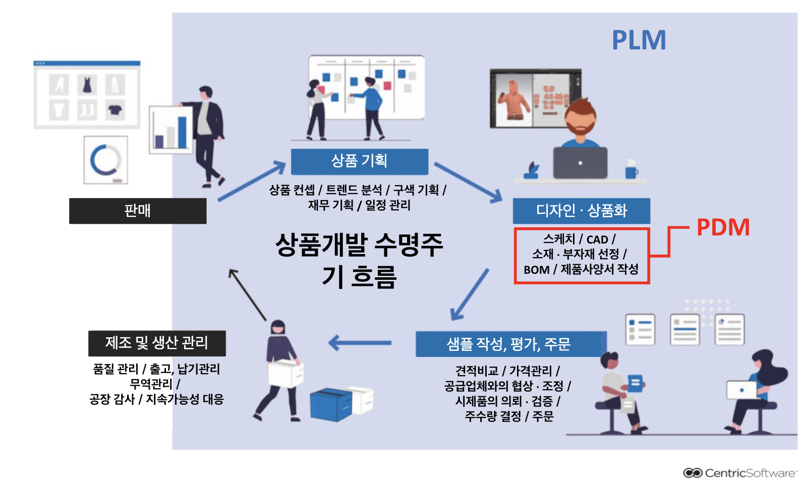
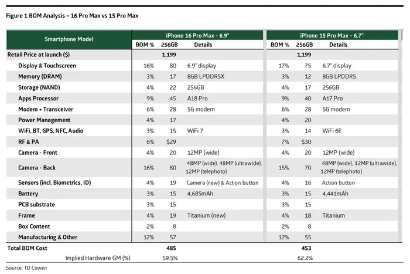

## PLM 

- `Product Lifecycle Management` 제품 수명 주기 관리
- 관리 대상 범위는 PDM의 기능을 포함하여 제품의 기획부터 개발, 설계/디자인, 조달, 제조, 판매, 그리고 폐기까지
-  제조업에 관련된 회사들로 대표적인 업종으로는 자동차, 항공, 조선, 가전, 반도체, 컴퓨터
-  쉽게 설명 하자면 `제품의 모든 것을 관리해주는 시스템`

## PDM

- `Product Data Management` 제품 데이터 관리를 의미한다
- 제품 개발 과 설계와 관련된 데이터를 관리하고 , 서로 다른 포맷의 제품 데이터도 통합적으로 관리하는 시스템
- 관리 대상 범위는 제품의 설계/디자인 데이터, CAD 도면, 명세서, BOM(자재 명세서), 관련 문서
- `BOM 동기화` 모든 제품의 BOM을 동기화해 변경 전후 차이를 확인

### BOM 

- `Bill of Material` 특정 제품을 생산 , 개발 , 판매하는데 필요한 재료를 정리한 목록
- `Sales Bill of Materials` SBOM 고객의 주문에 의한 `제품을 개발`하는데 필요한 구성
- `Engineering Bill of Materials` EBOM `제품 설계 단계`에서 사용되는 부품, 구성요소 목록
- `Manufacturing Bill of Materials` MBOM `제조 과정에서 필요한` 자재 및 부품 목록

